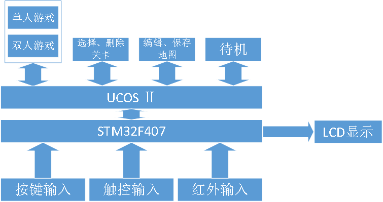
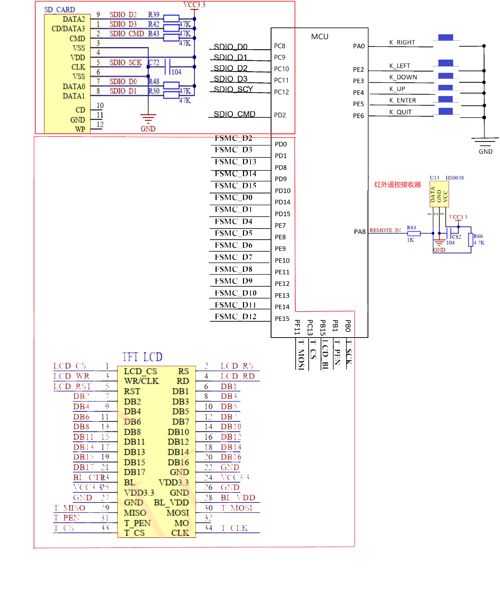
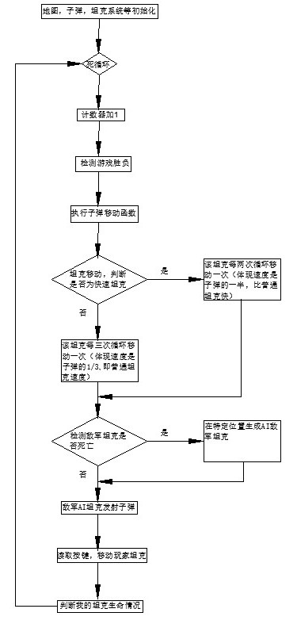

# Tank Game on STM32
An editable tank battle game designed for STM32 platform.

It supports up to two players and the players are allowed to devise their own game maps.

## System Overview
The operating system of the game is UCOS Ⅱ, which is an open source OS designed for microcomputer. An *overview of the game* is shown below.

The game includes two gaming modes (single-player / multi-player) and a map-editing mode. In the gaming mode, the players can use either buttons or IR remote controller to control their tanks. In the map-editing mode, users can devise their own game maps by drawing on the LCD screen.

## Hardware Requirements

- STM32F407 as MCU
- Six freestanding buttons
- SDIO module and SD card
- IR receiver and IR remote controller
- 2.8" TFT LCD screen

*The Electric Schematic Diagram* of the hardware is as follows.

## Main Logic of the Game

